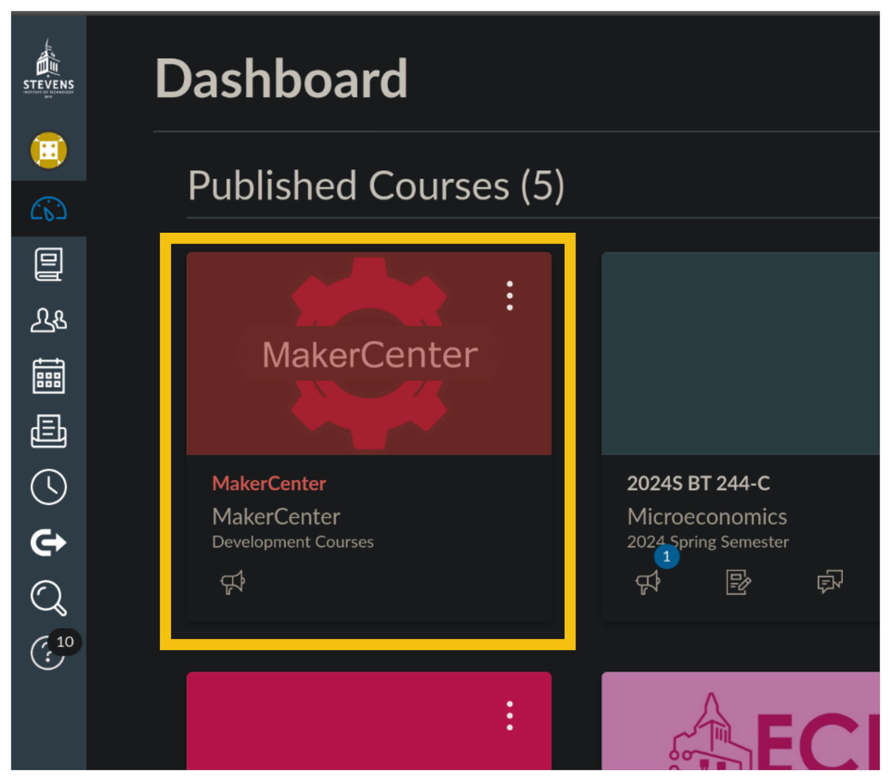
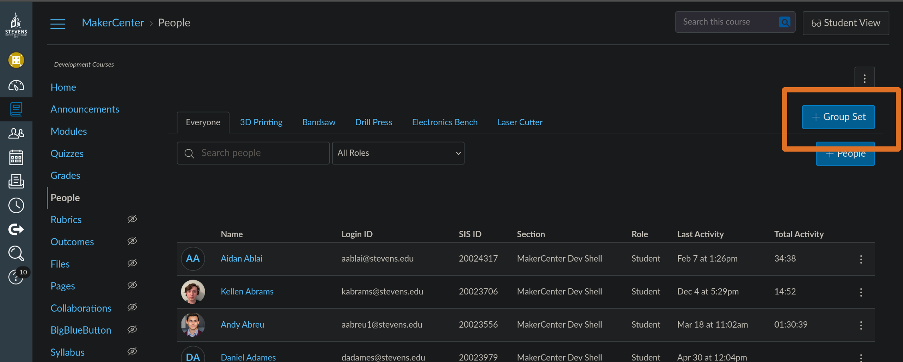
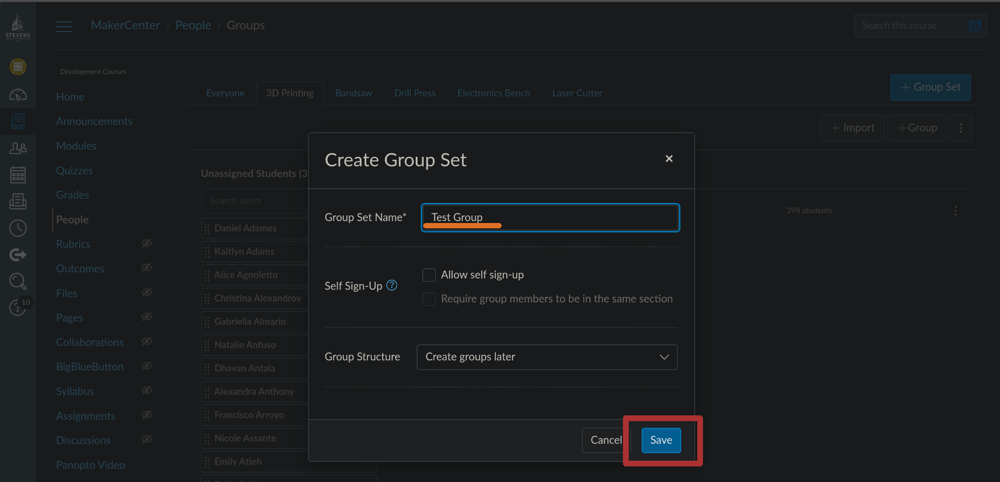
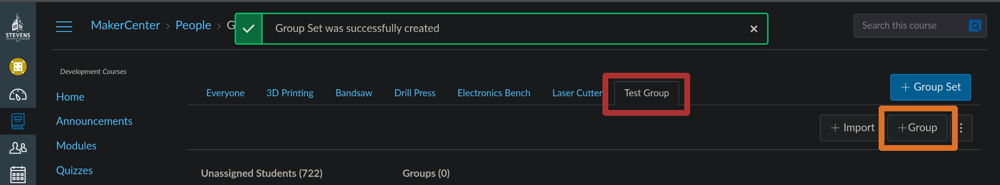
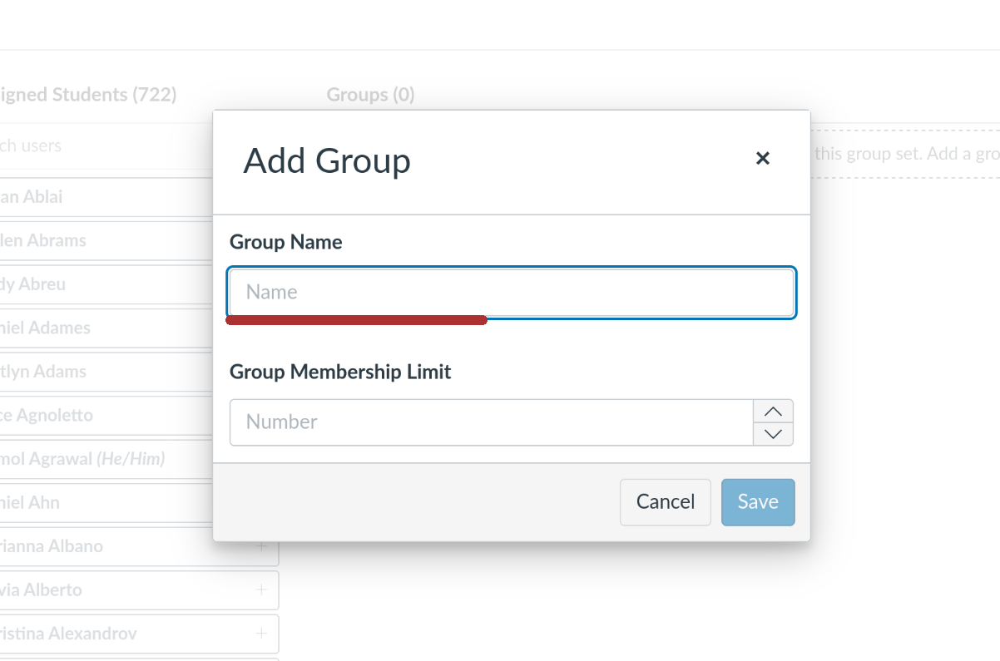

# Creating New Groups In Canvas

## Table Of Contents

- [Creating New Groups In Canvas](#creating-new-groups-in-canvas)
  - [Table Of Contents](#table-of-contents)

1. Go to Canvas Dashboard.
2. Go to Course. 
3. Go to People. 
4. Click +Group Set.
   
5. Enter a name and click save.
   
6. Go to the new group.
7. Click +Group. 
8. Enter a name and save.
   
