# Sync Configuration

## Table of Contents

- [Sync Configuration](#sync-configuration)
  - [Table of Contents](#table-of-contents)
  - [Location](#location)
  - [`[canvas]`](#canvas)
    - [`api_url`](#api_url)
    - [`api_key`](#api_key)
    - [`course_id`](#course_id)
  - [`[canvas.grit_permission_quizzes]`](#canvasgrit_permission_quizzes)
    - [Finding Grit Column Names](#finding-grit-column-names)
    - [Finding Quiz Ids](#finding-quiz-ids)
    - [Putting It Together](#putting-it-together)
  - [`[canvas.group_tracking_quizzes]`](#canvasgroup_tracking_quizzes)
    - [Finding Quiz Ids](#finding-quiz-ids-1)
    - [Putting It Together](#putting-it-together-1)
  - [`[canvas.quiz_id_to_group_id]`](#canvasquiz_id_to_group_id)
    - [Finding Quiz Ids](#finding-quiz-ids-2)
    - [Finding Group Ids.](#finding-group-ids)
    - [Putting It Together](#putting-it-together-2)
## Location

The location of the Sync config file is in `configs/sync_config.toml`. You can
begin by making a copy of the example configuration, located at
[configs/example_sync_config.toml](../configs/example_sync_config.toml).

## `[canvas]`

Here is where to place the URL of the institution's Canvas instance, your API
key, and your course id.

### `api_url`

The URL for Canvas is the same as what you use when using Canvas in a browser,
in the case of Stevens it is `https://sit.instructure.com`.


```toml
[canvas]
api_url = "https://sit.instructure.com"
```

### `api_key`

Your API key can be obtained through the browser. At Stevens it seems that
everybody is able to get as many keys as they want, however I do not know if
this is the case everywhere. The following are the steps required to obtain a
key:

1. Login to your canvas instance.
2. Click the account button, then settings.
   
   
3. Scroll down to Approved Integrations, and click New Access Token.
   
4. Enter a description for the token. If you want to have an expiration date you
   can, but then you'll have to remember to complete this process again whenever
   it expires. 
5. Copy down the access token given, this is your only opportunity to do so,
   otherwise you'll have to regenerate a new one.
   

Ensure that the user doing this has "Course Admin" permissions. If they have a
permission level lower than this they may be unable to perform some actions that
Sync uses.

Be extremely careful with this key, as if somebody else gets ahold of it they
can pretend to be you on Canvas, and make changes and modifications that appear
to come from you. Paste this key inside of the double quotes on the `api_key`
entry.

```toml
[canvas]
api_key = "YOUR_API_KEY"
```

### `course_id`

Your course id can be found through the browser. Go to the course you are
managing, and look for the id in the URL in the browser.


```toml
[canvas]
course_id = 123456
```

See the [example sync config](../configs/example_sync_config.toml) for more
information.

## `[canvas.grit_permission_quizzes]`

This section is a mapping between column names in Grit and their corresponding
quiz id in Canvas. Sync will check for submissions from the given quiz ids and
grant permissions in Grit to the corresponding column if the user has passed the
quiz (currently a passing grade is 90%, this may be configurable in the future).

### Finding Grit Column Names

The easiest way to figure out what the names of your columns are is to download
an export from Grit.

You do that with the following:

1. Go to your Grit instance url and login.
2. Go to the Grit Track Page.
   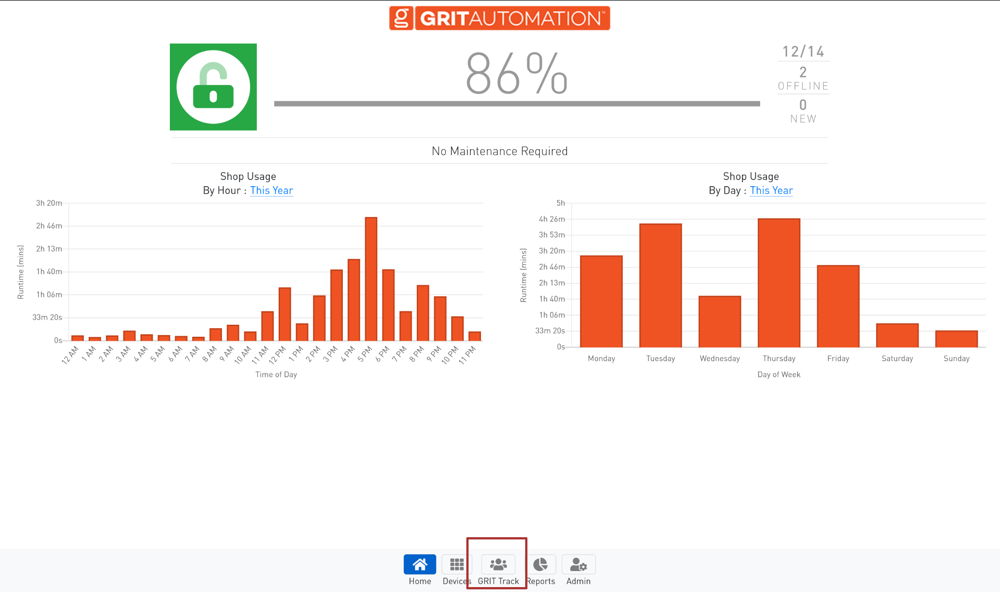
3. Go to the bulk import and export page.
   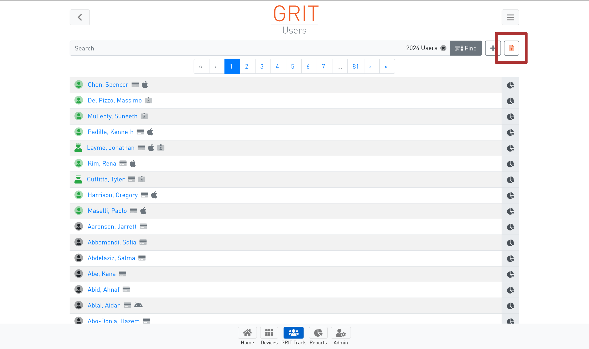
4. Click export users button, and wait for it to download.
   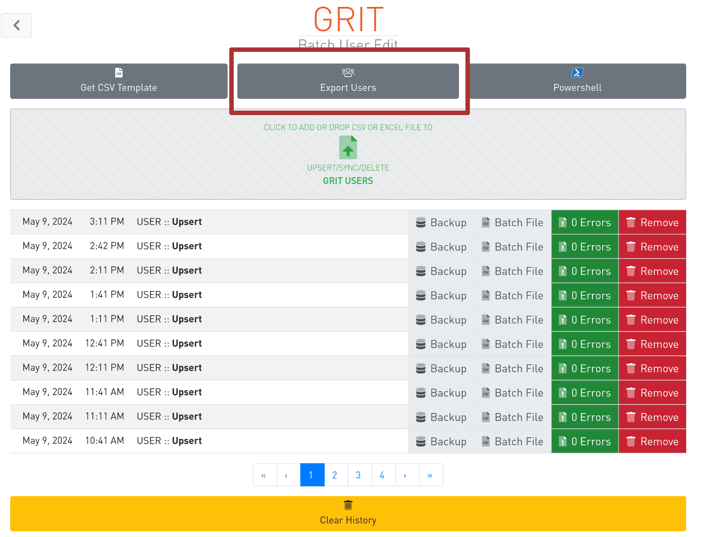
5. Open the downloaded Excel file.
6. Find the columns you want to grant permissions for.
   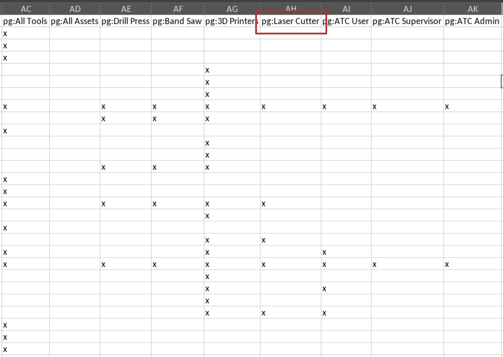

Let's use the Laser Cutter as an example, its column name is "pg:Laser Cutter".

### Finding Quiz Ids

1. Go to your Canvas course.
2. Look in the URL of the browser to see the id. <!-- pic -->

Using the Laser Cutter as an example again, its quiz id is 440133.

### Putting It Together

```toml
[canvas.grit_permission_quizzes]
"pg:Laser Cutter" = 440133
```

You can add as many additional quizzes as you like, following the same process.

## `[canvas.group_tracking_quizzes]`

This section is a mapping between arbitrary names, and their corresponding quiz
ids in Canvas. Sync will check for submissions from the given quiz ids, and
ensure that a user is added to grit with no permissions if they don't exist
there already. No actual permissions will be granted, the user is only added.
The name is only used for debugging information, you could make it whatever you
like, but it is recommended to make it something useful.

### Finding Quiz Ids

1. Go to your Canvas course.
2. Look in the URL of the browser to see the id. <!-- pic of printers -->

Using the 3D Printers as an example, its quiz id is 440132.

### Putting It Together

```toml
[canvas.group_tracking_quizzes]
"3D Printers" = 440132
```

## `[canvas.quiz_id_to_group_id]`

This section is a mapping between quiz ids, and a corresponding group id in
Canvas. Sync will check for submissions from the given quiz ids, and if the user
has passed a quiz, ensure they are added to the corresponding group in Canvas.

### Finding Quiz Ids

1. Go to your Canvas course.
2. Go to the Quizzes tab. 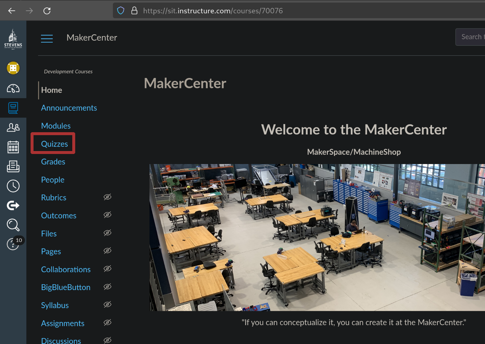
3. Choose the quiz you want the ID of.
   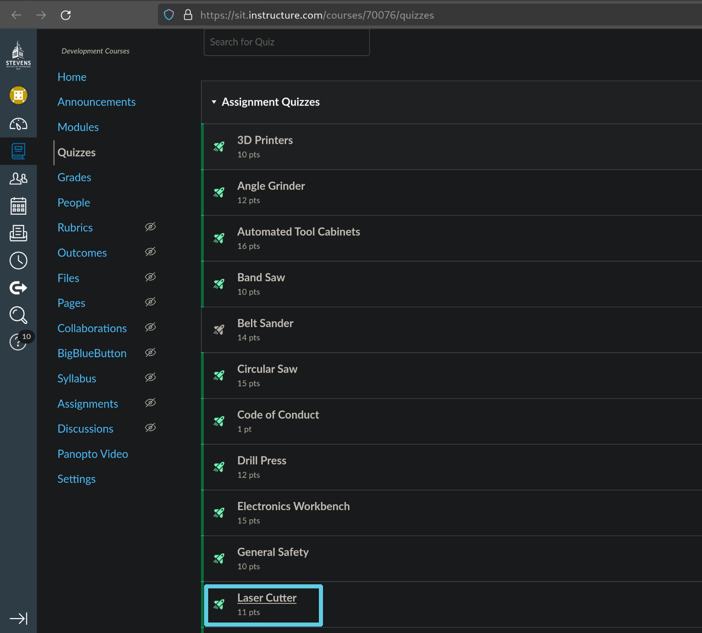
4. Look in the URL of the browser to see the id.
   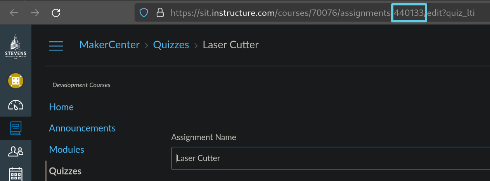

Using the Laser Cutter as an example, its quiz id is 440133.

### Finding Group Ids.

1. Go to your Canvas course.
2. Go to the People tab. 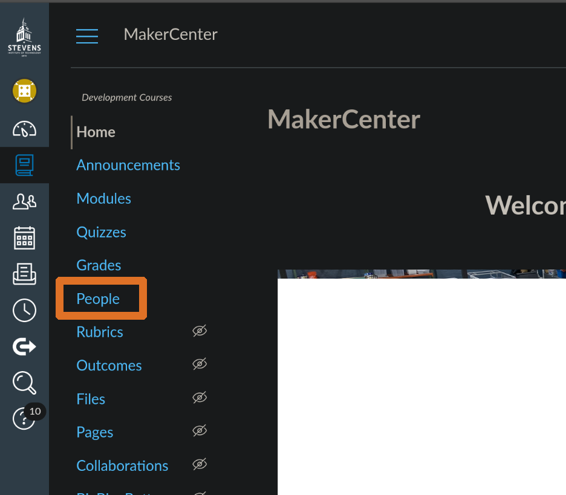
3. Go to the Group Set containing the group you want to use.
   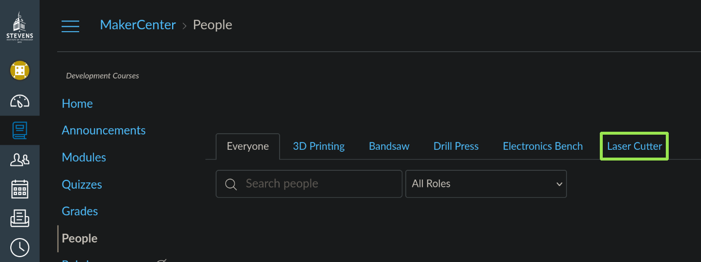
4. Click the three dots on the right of the group in the group set.
5. Click visit group homepage.
   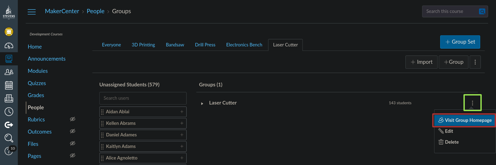
6. Look in the URL of the browser to see the id.
   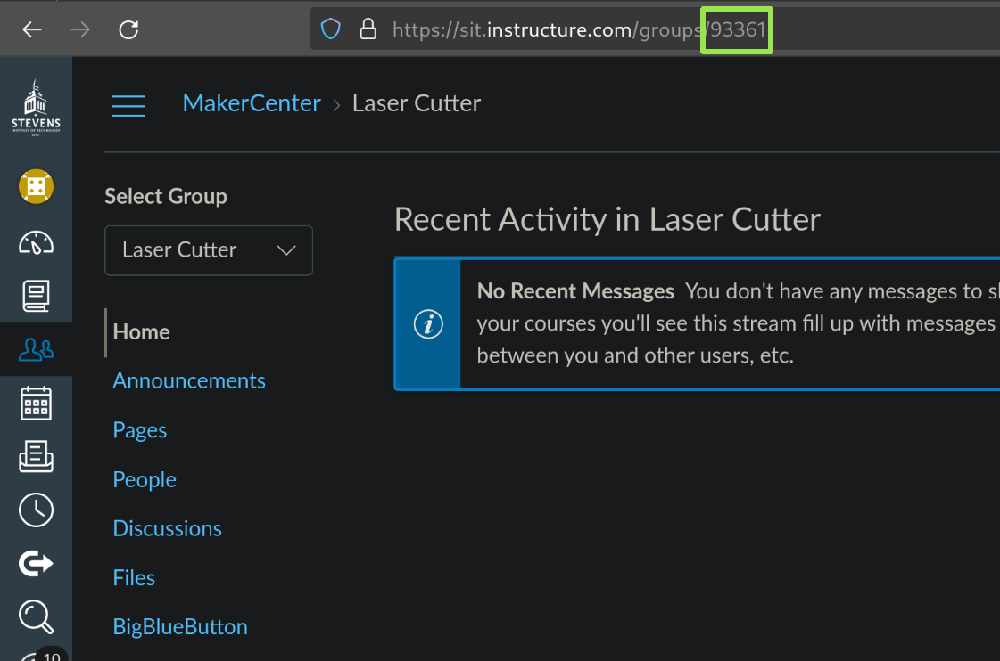

Using the Laser Cutter Group as an example, its group id is 93361.

### Putting It Together

```toml
[canvas.quiz_id_to_group_id]
440133 = 93361
```

