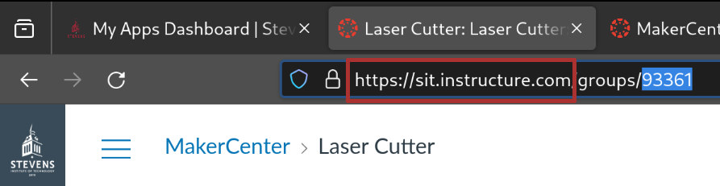
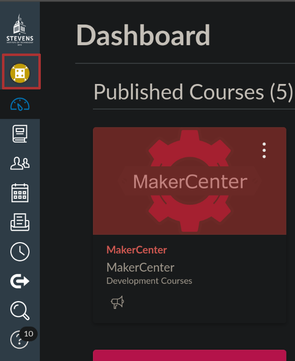
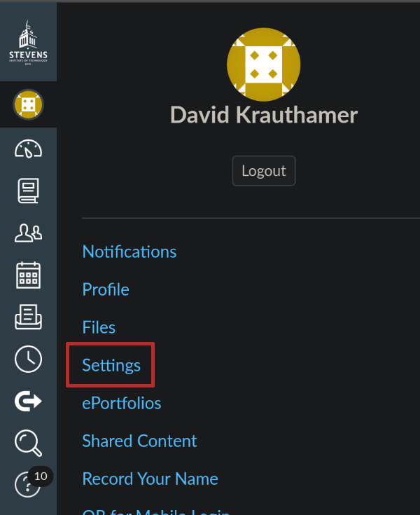
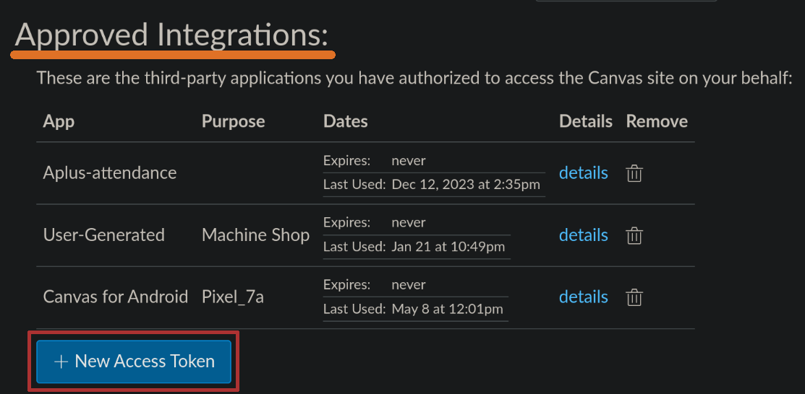
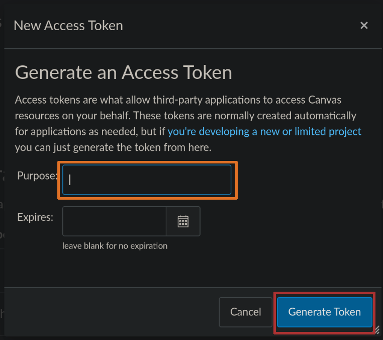
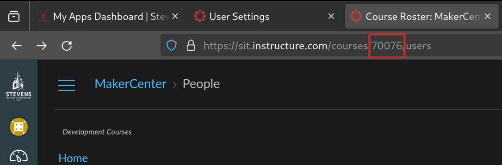

# Sync Configuration

## Table of Contents

- [Sync Configuration](#sync-configuration)
  - [Table of Contents](#table-of-contents)
  - [Location](#location)
  - [`[canvas]`](#canvas)
    - [`api_url`](#api_url)
    - [`api_key`](#api_key)
    - [`course_id`](#course_id)
## Location

The location of the Sync config file is in `configs/sync_config.toml`. You can
begin by making a copy of the example configuration, located at
[configs/example_sync_config.toml](../configs/example_sync_config.toml).

## `[canvas]`

Here is where to place the URL of the institution's Canvas instance, your API
key, and your course id.

### `api_url`

The URL for Canvas is the same as what you use when using Canvas in a browser,
in the case of Stevens it is `https://sit.instructure.com`.



```toml
[canvas]
api_url = "https://sit.instructure.com"
```

### `api_key`

Your API key can be obtained through the browser. At Stevens it seems that
everybody is able to get as many keys as they want, however I do not know if
this is the case everywhere. The following are the steps required to obtain a
key:

1. Login to your canvas instance.
2. Click the account button, then settings.
   
   
3. Scroll down to Approved Integrations, and click New Access Token.
   
4. Enter a description for the token. If you want to have an expiration date you
   can, but then you'll have to remember to complete this process again whenever
   it expires. 
5. Copy down the access token given, this is your only opportunity to do so,
   otherwise you'll have to regenerate a new one.
   

Ensure that the user doing this has "Course Admin" permissions. If they have a
permission level lower than this they may be unable to perform some actions that
Sync uses.

Be extremely careful with this key, as if somebody else gets ahold of it they
can pretend to be you on Canvas, and make changes and modifications that appear
to come from you. Paste this key inside of the double quotes on the `api_key`
entry.

```toml
[canvas]
api_key = "YOUR_API_KEY"
```

### `course_id`

Your course id can be found through the browser. Go to the course you are
managing, and look for the id in the URL in the browser.



```toml
[canvas]
course_id = 123456
```

See the [example sync config](../configs/example_sync_config.toml) for more
information.

